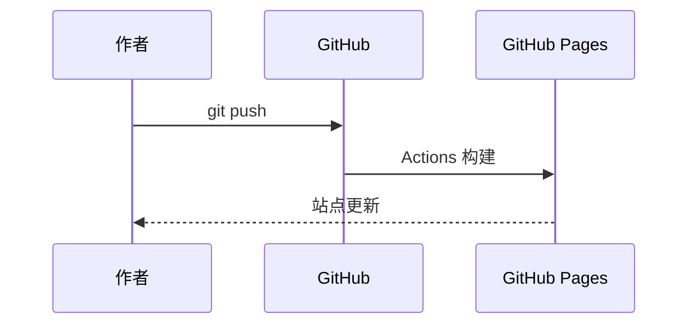
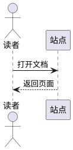

# 站点功能

- [在 GitHub 发布新文章](/guide/publish) — 新建 Markdown、自动构建、目录约定

## 锚点分享

将鼠标悬停在任意标题上，点击右侧链接图标即可复制该章节的直达链接。

## Mermaid 图表

在 Markdown 中使用 `mermaid` 代码块即可绘制流程图：


序列图示例：



## PlantUML 图表

使用 `plantuml` 代码块（通过 Kroki 渲染，需联网）：



## Graphviz 图表

使用 `dot` 或 `graphviz` 代码块：


## 代码块增强

所有代码块默认显示**行号**。标题栏提供：

- **复制** — 一键复制代码
- **换行** — 切换长行自动换行（默认横向滚动）
- **折叠** — 超过 18 行的代码块可折叠展开

点击任意代码行可**高亮当前行**（再次点击取消）。

在代码块语言后标注行号可静态高亮，例如：

````md
```json {5-8}
{
  "registry-mirrors": [
    "https://docker.example.com"
  ]
}
```
````
